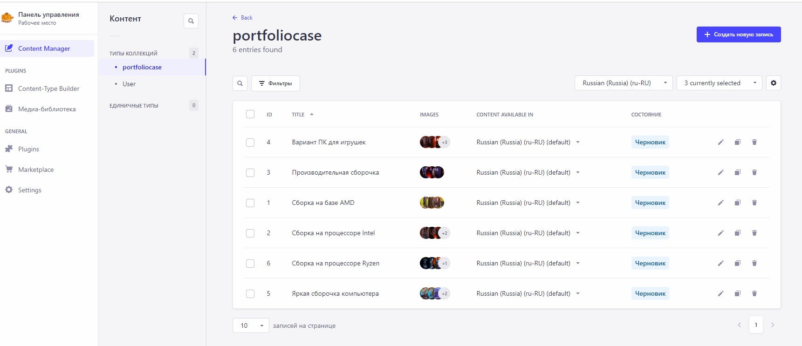

<h1 align="center">
    📰 HappyPC
</h1>

## Проект HappyPC развернут при помощи yarn create next-app --typescript

**[Ссылка на сайт](https://happypc.pro/)**

## ✍🏻 Краткое описание проекта
Проект представляет собой корпоративный сайт компании с описанием предоставляемых услуг, кейсов портфолио, контактной информации, формы заявки на услуги.

Сайт состоит из 12 страниц:
- Главная. Содержит 5 информациооных блоков. Кейсы портфолио приходят при помощи асинхронных запросов к собственному API Strapi.
- Страница Услуги. Содержит информационный блок с карточками услуг, а также контактную информацию и яндекс карту.
- Страница Портфолио. Содержит информационный блок с кейсами портфолио работ. Кейсы с портфолио приходят при помощи асинхронных запросов к собственному API Strapi. При клике по каждому из превью портфолио открывается страница, которая содержит динамический слайдер с изображениями, выполненный с помощью Slider React Slick, описание комплектующих, ссылки на страницы услуг, соцсети.
- Страница О нас. Содержит информационные блоки с описанием компании, этапы работ, часто задаваемые вопросы.
- Страница Контакты. Содержит контактную информацию компании и яндекс карту.
- Страница Заказать сборку. Содержит форму "Оставить заявку", отправка данных осуществляется в телеграм заказчика.
- Страницы Сборка компьютера, Апгрейд компьютера, Подборка комплектующих, Ремонт компьютера. Содержат по 3 информационных блока с описанием услуги, включая форму "Оставить заявку", блок этапов работ и блок часто задоваемых вопросов.

CMS Strapi

## 📖 Задачи

- Проект адаптирован под различные разрешения экрана, соответствует макетам, сделанным для них.
- Все блоки из макета свёрстаны. Корректно работает навигация между страницами и ссылки на внешние ресурсы.
- Отзывчивая вёрстка, которая корректно тянется на всех промежуточных разрешениях.
- Отсутствуют ошибки валидации.
- В коде используется семантическая разметка: применяются семантические теги, выбор элементов при вёрстке корректен (параграф должен быть параграфом, список — списком); структура DOM-дерева состоит не только из контейнеров div.
- Для позиционирования элементов выбран верный подход, описанный корректным синтаксисом.
- Разметка портирована в TSX.
- Правильно работают оба состояния header.
- Правильно работает сабмит формы.

## 📃 Стек

- TSX, SCSS
- MUI
- TypeScript
- React
- Next
- Node.js
- CMS Strapi
- БЭМ

## 💻 Установка зависимостей

##### `yarn` – установить зависимости проекта

##### `yarn dev` – запуск devServer на http://localhost:3000/

##### `yarn build` – production сборка проекта